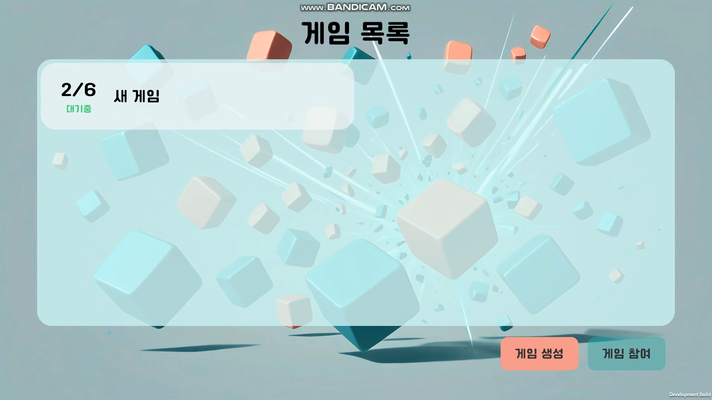
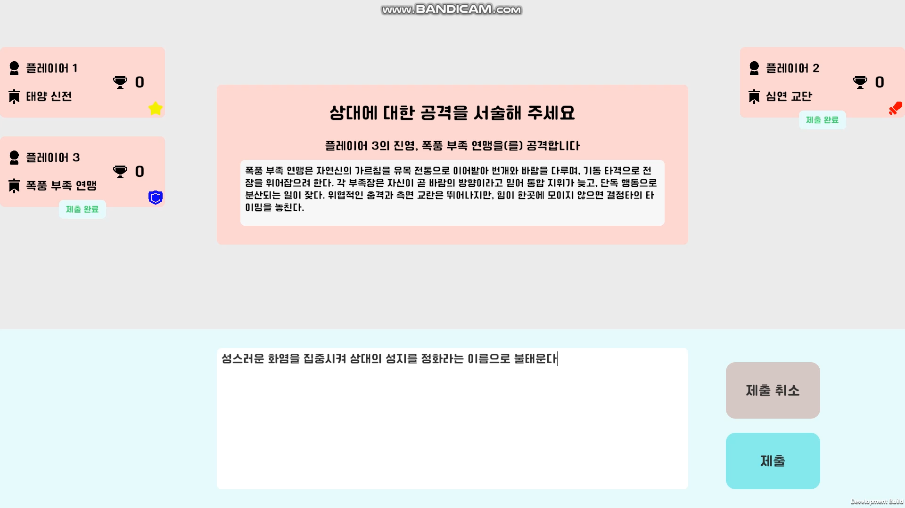
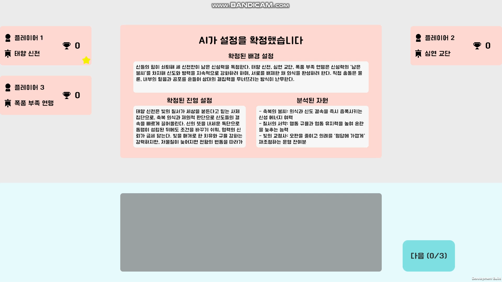
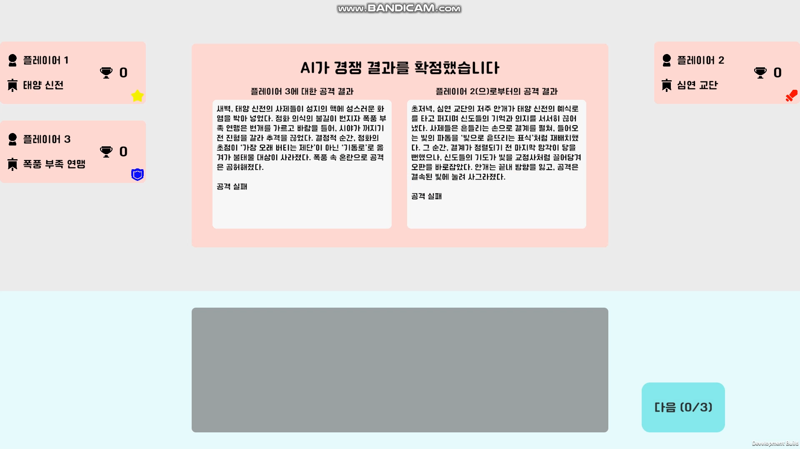

# RIXA

> A real-time multiplayer party game with LLM-generated narratives  
> Currently Korean-language only

---

## 1. Overview

RIXA is a real-time multiplayer party game for 2–6 players.  
Players define their own factions — their concepts and flaws — and engage in rounds of attack and defense using natural language input. An LLM judges each clash, generates battle narratives, and updates the game state accordingly.

This project was built as a portfolio piece to demonstrate two core competencies:

- **Designing and implementing a server-client multiplayer architecture**
- **Integrating LLM APIs into a functional game pipeline**

- **Genre:** Real-time Multiplayer / Party
- **Development Period:** January 2026 – May 2026
- **Team:** Solo (Game Design, Server, Client, AI Pipeline, Background Art)
- **Engine:** Unity 6 (C#)
- **Backend:** Node.js + WebSocket
- **Platform:** Windows Standalone

---

## 2. Demo Video

[▶ Watch the Demo on YouTube](https://youtu.be/qphnykokIEQ)

---

## 3. Screenshots

<p align="center">
  
  
</p>
<p align="center">
  
  
</p>

---

## 4. Tech Stack

| Area | Technology |
|---|---|
| Client | Unity 6 (C#), NativeWebSocket, Newtonsoft.Json |
| Server | Node.js, ws |
| AI Pipeline | OpenAI API (gpt-5.4-nano), JSON Schema structured output |
| Background Art | ComfyUI |
| Tools | Git |

---

## 5. Key Technical Points

### 5-1. LLM Pipeline

The core of RIXA is a three-phase LLM pipeline that transforms player input into structured game data.

```
[Phase 1: Context Setup]
Player input (world setting, faction concepts, flaws)
→ LLM generates polished world description, faction summaries, and resource sets

[Phase 2: Competition Analyze]
Player input (attack / defense descriptions)
→ LLM extracts semantic tags (positive / negative) from each submission
→ Tag balance is used to calculate win probability for each matchup

[Phase 3: Competition Narrate]
Match results (winner, lost resource)
→ LLM generates in-world battle narrative and updates the event log
```

Key implementation details:

- **JSON Schema-enforced structured output**: LLM responses are constrained to a strict schema so the game server can consume them directly without fragile parsing
- **Tag-based probability system**: The LLM assigns positive and negative semantic tags to each player's input. The difference between attacker and defender tag counts, multiplied by a weight, is added to the base win probability — making the quality of player input matter without removing randomness entirely
- **Timeout + exponential backoff retry**: Each LLM call is wrapped with a configurable timeout and retry logic to handle network instability gracefully
- **Stateless per-session design**: Each pipeline phase is independently callable, making the system easy to test and extend

### 5-2. Multiplayer Server Architecture

The server is built around a phase-based state machine that governs the entire game lifecycle.

```
LOBBY
  → CONTEXT_INPUT
  → FACTION_CONCEPT_INPUT
  → FACTION_FLAW_INPUT
  → CONTEXT_SETUP (LLM call)
  → CONTEXT_SETUP_FINISH
  → ATTACK
  → DEFENSE
  → COMPETITION_ANALYZE (LLM call)
  → COMPETITION_NARRATE (LLM call)
  → COMPETITION_FINISH
  → (next round or END)
```

Key implementation details:

- **Phase-gated actions**: Every player action is validated against the current phase, preventing out-of-order submissions
- **Round-offset matchmaking**: Each round, attacker-defender pairs are assigned using a rotating offset pattern. Every player faces each other player once per cycle, with the order randomized each cycle. For example, with 4 players, player 1 might face opponents in the order 2→4→3→2→4→3 across rounds
- **Player-count-aware balancing**: Total rounds and starting resource counts scale automatically with player count

### 5-3. Unity Client

- **Panel / Dialog system**: A stack-based dialog manager handles layered dialogs on top of persistent game panels, with global ESC / Enter keyboard shortcuts. Dialog management was a deliberate design focus absent from the previous project (Spider)
- **Event-driven UI updates**: Game state changes are propagated via C# events, keeping UI logic decoupled from network logic
- **External config**: Server URL is loaded from `config.json` at runtime, so the server address can be changed without recompilation
- **Cross-platform support**: Conditional compilation (`#if UNITY_WEBGL`) handles platform differences between WebGL and Windows Standalone

---

## 6. Game Flow

```
1. Lobby          Players join and ready up
2. World Setup    The leader inputs the world background
3. Faction Input  Each player defines their own faction concept,
                  then inputs a flaw for another player's faction (assigned randomly)
4. LLM Setup      LLM processes all input and generates the world context,
                  faction descriptions, and starting resources
5. Combat         Each round, players submit attack and defense descriptions
6. Judgment       LLM extracts tags, calculates win probability, determines the winner,
                  and generates a battle narrative
7. Result         Final rankings decided by score; ties broken by remaining resources
```

---

## 7. How to Run

### Requirements

- Node.js v20.3.1 or higher

### Server

```bash
cd server
npm install
npm start
```

### Client

Set the server address in the config file before running:

**In Editor:**
```
Assets/StreamingAssets/config.json
```

**In Build:**
```
Build/Rixa_Data/StreamingAssets/config.json
```

```json
{ "serverUrl": "ws://YOUR_SERVER_IP:7363" }
```

Then run the Unity build or play directly from the editor.

> **Note:** The game requires all players to be on the same network or the host to have port 7363 open and forwarded.

---

## 8. Development Retrospective

**What this project set out to prove:**  
That I can design and ship a working multiplayer game with a non-trivial backend — not just a Unity client, but a full server-client system with real-time state synchronization and an integrated AI pipeline.

**Challenges and what I learned:**

- The biggest challenge was managing state synchronization in a server-authoritative architecture. The server owns the game state and clients hold only a local replica, which introduced a category of bugs that simply don't exist in single-player development — stale state, out-of-order updates, and edge cases in async message handling. Debugging these issues early in development required building a much clearer mental model of who owns what and when.
- Multiplayer game development over a server-client architecture means living with asynchrony everywhere. Inputs, LLM calls, and state broadcasts all arrive at different times, and building the UI to handle this gracefully without subtle race conditions was a continuous design challenge.
- Designing the LLM pipeline required careful prompt engineering and output schema design to ensure the model's responses were always parseable and game-ready. Handling edge cases (timeouts, malformed output) was as important as the happy path.

**If I were to continue:**
- **Settings screen**: Volume controls and other in-game preferences are not yet implemented
- **End-game statistics**: Rather than showing only the winner, surfacing interesting match stats would suit the party game format well
- **World Disruption mechanic**: A planned but unimplemented feature — the last-place player gains the ability to alter the world context mid-game, adding a comeback mechanic and narrative chaos

---

## 9. Contact

- **Email:** sadgabriel@protonmail.com
- **GitHub:** https://github.com/sadgabriel
- **Repository:** https://github.com/sadgabriel/Rixa